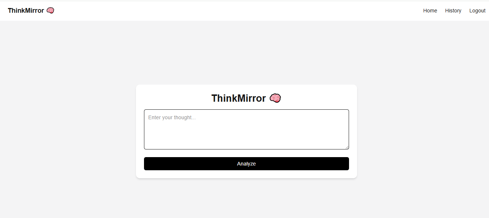
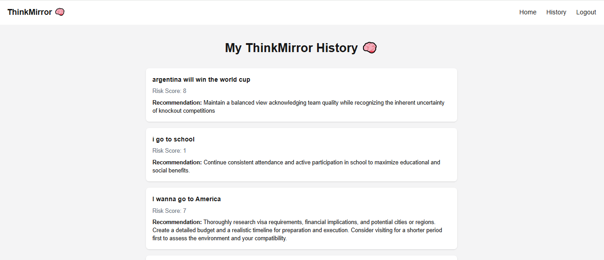
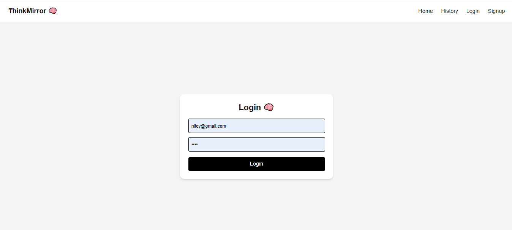
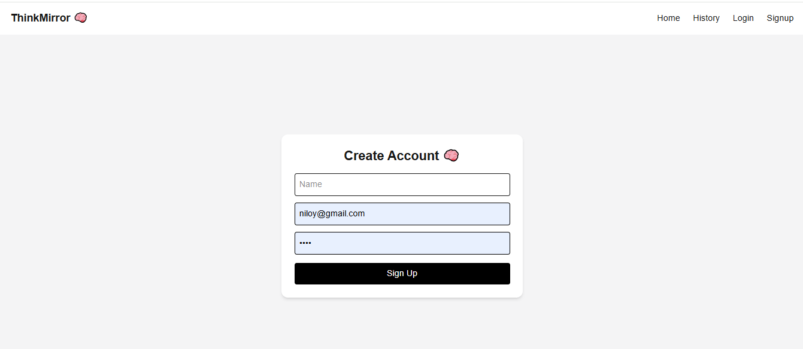

# 🎨 ThinkMirror Frontend — AI-Powered Decision Analysis UI

## 🔗 Project Repositories
- ⚙️ Backend: https://github.com/ALIM23700/ThinkMirror_Backend  

## 🌐 Live Demo
👉 https://think-mirror-frontend.vercel.app/

---

## 🧩 Project Overview
This is the frontend of the ThinkMirror application, built using Next.js and Tailwind CSS.  
It provides a modern, responsive, and user-friendly interface for interacting with the AI-powered decision analysis system.

Users can write their thoughts, receive AI-generated counter-arguments, and manage their history efficiently through a clean UI.

---

## ⚙️ Tech Stack
- **Framework:** Next.js  
- **Styling:** Tailwind CSS  
- **State Management:** React Hooks (useState, useEffect)  
- **Routing:** Next.js App Router  
- **API Communication:** Fetch / Axios  
- **Authentication Handling:** JWT (via localStorage)  
- **Deployment:** Vercel  

---

## ✨ Features
- 🧠 User-friendly interface for **AI-generated analysis**  
- 🔐 Authentication UI (Login / Signup / Logout)  
- 📝 Thought submission and interaction system  
- 📜 History page for viewing past analyses  
- ⚡ Fast and dynamic UI updates  
- 📱 Fully responsive design (mobile + desktop)  
- 🔒 Protected pages (restricted access for logged-in users)  
- 🎯 Clean and modern UI/UX design  

---

## 🧠 How It Works (Frontend Architecture)

User Interface (Next.js Pages)  
↓  
Reusable Components  
↓  
API Calls (Backend Integration)  
↓  
State Management (React Hooks)  
↓  
Dynamic UI Updates  

---

## 🚧 Challenges & Learnings
- Managing authentication state across multiple pages  
- Handling async API calls efficiently  
- Structuring reusable components for scalability  
- Protecting routes based on login state  
- Designing responsive UI for different screen sizes  

---

## 📁 Project Structure
- `app/` → Pages and routing  
- `components/` → Reusable UI components  
- `utils/` → API calls and helper functions  
- `styles/` → Global styles and Tailwind config  

---

## ⚙️ Setup Instructions

### 1️⃣ Clone the repository
```bash
git clone https://github.com/ALIM23700/ThinkMirror_Frontend.git

## 2️⃣ Install dependencies
```bash
npm install
3️⃣ Setup environment variables

Create .env.local file:

4️⃣ Run the project
npm run dev
---

## 📸 Screenshots

### Home Page
 

### Thought History


### Login Page


### Signup Page


---

## 🚀 Future Improvements
- Add sentiment analysis visualization (charts)  
- Improve AI accuracy with better prompt engineering  
- Add dark/light theme toggle  
- Enable sharing thoughts publicly  
- Add role-based admin dashboard  

---

## 💯 Key Highlights
- Full-stack MERN architecture  
- AI-powered functionality (beyond basic CRUD apps)  
- Clean and responsive UI  
- Secure authentication system  
- Real-world problem-solving approach  
